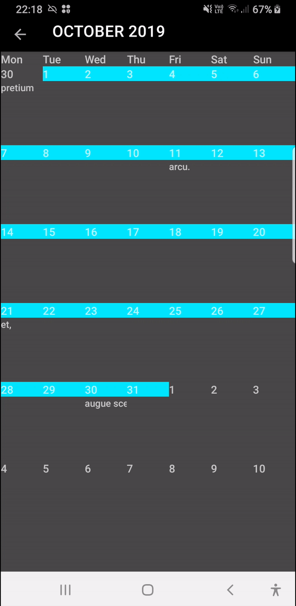
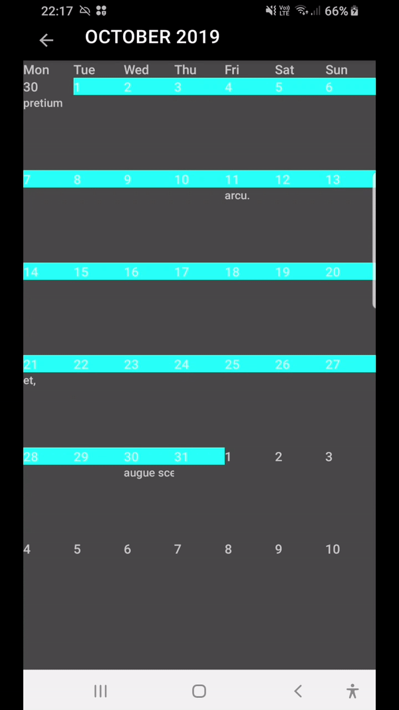

# CBTOrganisation

## Introduction
This is an app I produced for my final year Project and to learn and practice various aspects of Android Development, Kotlin and Software Architecture/Seperation of concerns.

* Kotlin
* Single Activity Architecture
* Clean Architecture
* Coroutines
* Room
* LiveData
* Android navigation Library
* Android Databinding
* Android ViewModel
* Dagger 2(Previously Koin)
* ThreetenABP
* Google Flexbox
* Material Design Library
* Junit5
* MockK
* MotionLayout
* Moshi
* Timber

## Month Calender

Two iterations of a month calendar similar in function to the one in the Google Calenda Android app made using  nested recyclerviews(on the left) and a viewpager with a recyclerview (on the right). By properly seperating code (e.g like into this [MonthCalendarInteractor](/app/src/main/java/com/fyp/kweku/cbtoganisation/tasks/domain/interactors/MonthCalendarInteractor.kt)) I was able to play around with the presentation with less rewriting of code

  

## Tasks By Day, View Task and Edit Task

## Tasks By Location with Debouncing Search

